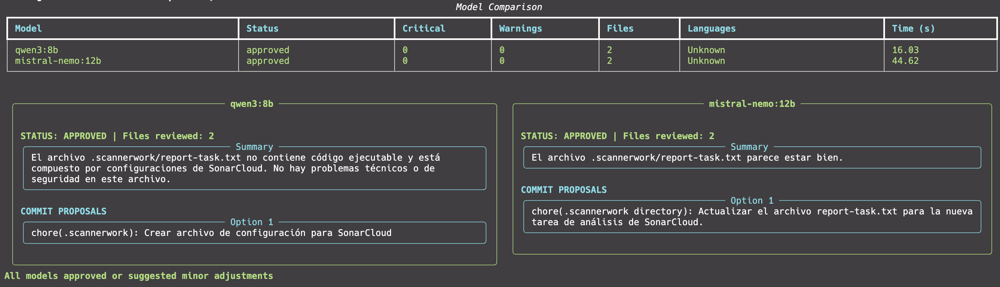

# 🤖 git-agent: AI-Powered Local Code Reviewer

**git-agent** is a powerful CLI tool that acts as your personal Senior Software Engineer. It uses local LLMs (via Ollama) to review your git changes, enforcing best practices, detecting bugs, and suggesting refactors before you commit.


## ✨ Key Features

- **🚀 Multi-Model Parallel Execution**: Compare reviews from different LLMs (e.g., Qwen vs. Mistral) simultaneously to get diverse perspectives.
- **🔒 100% Local Privacy**: Runs entirely on your machine using Ollama. Your code never leaves your network.
- **🧠 Context-Aware Analysis**: Automatically gathers:
  - `git diff` (staged changes).
  - Full file content for context.
  - Linter results (Ruff for Python, ESLint for JS/TS).
- **🎨 Beautiful TUI**: Features a modern Terminal User Interface with:
  - Real-time progress bars and spinners.
  - Syntax-highlighted code blocks.
  - Responsive side-by-side comparison tables.
  - Dynamic grid layouts for multi-model results.
- **🏗️ Clean Architecture**: Built with strict adherence to SOLID principles, Domain-Driven Design (DDD), and Hexagonal Architecture (Ports & Adapters).

## 📸 Screenshots

<p align="center">
  
</p>

> **Tip**: The TUI automatically adapts layout based on the number of models running (1, 3, 5, etc.).

## 🛠️ Prerequisites

### ⚡ Quick Setup (Automated)

We provide a script to automatically install **Ollama**, **uv**, pull the recommended models, and install the tool globally:

```bash
./setup.sh
```

### Manual Prerequisites

1. **Python 3.10+** installed.
2. **Git** installed and initialized in your project.
3. **Ollama** running locally with your preferred models pulled.

    ```bash
    ollama pull qwen2.5-coder:7b
    ollama pull mistral-nemo:12b
    ollama pull qwen3:8b
    ```

## 📦 Installation

You can install `git-agent` globally using `uv` (recommended) or `pip`.

### Option A: Using `uv` (Recommended)

```bash
# Clone the repository
git clone https://github.com/yourusername/git-agent.git
cd git-agent

# Install as a global tool
uv tool install . --force
```

### Option B: Using `pip`

```bash
pip install .
```

### Option C: Run Without Installing (Dev Mode)

If you prefer not to install it globally, you can run it directly from the source using `uv`.

1. Navigate to your target project.
2. Run the agent pointing to its source directory:

```bash
uv run --project /absolute/path/to/git-agent python -m git_agent.cli
```

*Tip: Create an alias in your shell to make this easier:*

```bash
alias git-agent="uv run --project /Users/leo/Documents/projects/personal/git-agent python -m git_agent.cli"
```

## 🚀 Usage

Once installed, you can run `git-agent` from **any git repository** on your system.

### 1. Basic Review (Default Model)

Runs a review on your currently staged changes using the default model (`qwen2.5-coder:7b`).

```bash
git-agent
```

### 2. Multi-Model Comparison

Run multiple models in parallel to compare their feedback. The TUI will show a comparison table and detailed side-by-side views.

```bash
git-agent --models qwen2.5-coder:7b,mistral-nemo:12b,llama3:8b
```

### 3. Adding User Context

You can pass additional instructions or context as arguments.

```bash
git-agent "Check for strict typing compliance and ensure variable names are descriptive"
```

### 4. Combine Everything

```bash
git-agent --models qwen2.5-coder:7b,deepseek-r1:7b "Focus on security vulnerabilities"
```

## ⚙️ Configuration

The tool uses `dotenv` to load environment variables. You can create a `.env` file in your project root or set variables globally.

| Variable | Description | Default |
| :--- | :--- | :--- |
| `OLLAMA_HOST` | URL of your local Ollama instance | `http://localhost:11434` |
| `OLLAMA_MODEL` | Default model to use if none specified | `qwen2.5-coder:7b` |

## 📊 LLM Benchmark & Engineering Insights

This section documents the extensive testing conducted to select the best local LLMs (via Ollama) for code review tasks.

### 🏆 Final Verdict: The "Gold Master" Stack

After multiple iterations and prompt refinements, this is the winning configuration for a local production environment:

| Role | Model | Recommended Use |
| :--- | :--- | :--- |
| **🥇 Primary Reviewer** | **`qwen2.5-coder:7b`** | Best for architectural critique, detecting improvements (e.g., suggesting `typer` vs `argparse`), and consistency. |
| **🥈 Sanity Check** | **`qwen3:8b`** | Good for high-level overview, SOLID/DRY principles, and as a backup if the primary is too pedantic. |
| **🥉 Strict Alternative** | **`mistral-nemo:12b`** | Good for security, but showed instability (prone to quick false positives) in recent tests. |

#### ⚙️ Critical Configuration

To ensure these models perform correctly, the following technical adjustments were applied:
- **Prompt:** Explicit injection of line numbers (`12 | import sys`) to prevent location hallucinations.
- **Context:** Filtering of lock files (`uv.lock`, `package-lock.json`) to avoid "Context Flood".
- **Ollama Params:** `num_ctx: 16384`, `temperature: 0.2`.

---

### 🧪 Round 1: Mass Test (Brute Force)

**Objective:** Evaluate stability and reasoning capability with the initial prompt.
**Command:**

```bash
uv run git_agent.cli --models deepseek-r1:7b,llama3.1:8b,glm4:latest,mistral:latest,llama3.2:3b,gemma3:4b,qwen2.5:7b,qwen3:8b,phi3:3.8b,qwen2.5-coder:7b
```

#### Results & Findings

In this phase, the presence of `uv.lock` saturated the context, causing most models to believe the PR was just a dependency update.

| Model | Status | Diagnosis |
| :--- | :--- | :--- |
| **Gemma3:4b** | 💀 CRASH | Could not maintain JSON format (`Unterminated string`). |
| **Phi3:3.8b** | 💀 CRASH | JSON syntax failure on long responses. |
| **DeepSeek-R1:7b** | ⚠️ Unstable | Requires manual cleaning of `<think>` tags and struggles with strict JSON prompts. |
| **Llama 3.1 / 3.2** | ❌ Hallucination | Approved code without reading it ("Rubber Stamp"), blinded by the lock file. |
| **Mistral / Qwen** | ✅ Acceptable | The only ones to show initial skepticism. |

---

### 🧪 Round 2: Final Selection (Optimized Context)

**Objective:** Test finalists with the improved prompt (Line Numbers) and noise exclusion.
**Command:**

```bash
uv run git_agent.cli --models qwen3:8b,mistral-nemo:12b,qwen2.5-coder:7b
```

#### Detailed Finalist Analysis

**1. Qwen2.5-Coder:7b (The Revelation)**
- **Time:** ~189s
- **Verdict:** **NEEDS_FIXES**
- **Analysis:** Initially passive, but with the new prompt, it transformed into a senior architect. It suggested real refactors (switching `argparse` to `typer`, improving exception handling in `agent.py`). It read the code with the greatest depth.

**2. Qwen3:8b (The Balance)**
- **Time:** ~112s
- **Verdict:** **APPROVED**
- **Analysis:** Perfectly understood the modular architecture. Found no blocking errors but validated that the code followed best practices. Ideal as a quick second opinion.

**3. Mistral-Nemo:12b (The Quick Trigger)**
- **Time:** ~20s
- **Verdict:** **REJECTED**
- **Analysis:** Although theoretically powerful (12B), in this test it responded too quickly and hallucinated an "off-by-one" error in a loop that didn't exist. Discarded as a primary due to this inconsistency, though its "block when in doubt" stance is valuable for security.

---

### 📝 Implementation Notes

To reproduce the success of Round 2, the Ollama client must be configured as follows:

```python
# src/infra/llm_client.py
options = {
    "temperature": 0.2,      # Low creativity for higher precision
    "num_ctx": 16_384,       # Wide window to read full diffs
    "repeat_penalty": 1.1,   # Avoid loops in JSON
}
```

### ⚠️ Lessons Learned (Troubleshooting)

#### 1. Ollama Tag Formatting

During tests, `qwen2.5-coder:7b` failed with a `404 Not Found` error because the script tried to call `qwen2.5-coder:7`.
- **Solution:** Always validate that the name in the command matches `ollama list` exactly. 7B models explicitly require the `:7b` suffix.

#### 2. Reasoning Models (DeepSeek-R1)

"R1" type models generate a chain of thought between `<think>...</think>` tags.
- **Problem:** If using Ollama's native `format: json` mode, the model often fails or the Python parser cannot process the response because the thought process is not valid JSON.
- **Solution:** For DeepSeek, it's better to disable strict format in the API and clean the response in Python by removing everything between thought tags before doing `json.loads()`.

#### 3. Linter "Noise" Filter

In early rounds, the agent reported "49 issues" when the code was clean.
- **Cause:** The script interpreted Ruff's success line (`All checks passed!`) as a text issue.
- **Solution:** Filtering was implemented in `src/infra/linter.py` to ignore success messages and only capture real errors. This prevented LLMs from being confused by the issue count.

#### 4. JSON Stability in Small Models (< 7B)

Models like **Gemma3:4b** and **Phi3:3.8b** proved unreliable for generating complex and long JSON structures.
- **Recommendation:** Do not use models with fewer than 7B parameters for review tasks requiring strict structured output, as they tend to truncate closing quotes or brackets.

---

### 🛠 Improvement Suggestions for the Agent

* **Add "Reflection" Mode:** Ask the model to review its own JSON before sending it.
- **Consistency Validation:** Implement logic in Python that forces the state to `REJECTED` if the `critical_bugs` list is not empty, regardless of what the model's `approval_status` field says (to avoid excessive kindness from models like Qwen3).

## 🏗️ Architecture

This project is engineered as a reference implementation of **Clean Architecture** in Python:

- **Domain Layer** (`src/git_agent/domain`): Pure business logic, models, and interface definitions (Ports). No external dependencies.
- **Application Layer** (`src/git_agent/application`): Orchestrates use cases (e.g., `ReviewService`, `GitSeniorAgent`).
- **Infrastructure Layer** (`src/git_agent/infra`): Concrete implementations of ports (Git, FS, Ollama Client, Linters).
- **Presentation Layer** (`src/git_agent/ui`): Rich-based TUI for output.

